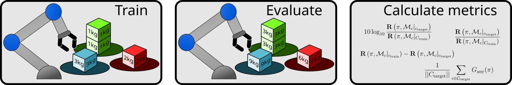

# Metrics for Assessing Generalization of Deep Reinforcement Learning in Parameterized Environments
### [Paper](https://sciendo.com/article/10.2478/jaiscr-2024-0003)

> "Metrics for Assessing Generalization of Deep Reinforcement Learning in Parameterized Environments"<br/>
> [Maciej Aleksandrowicz](https://macmacal.github.io), [Joanna Jaworek-Korjakowska](https://home.agh.edu.pl/~jaworek/)<br/>
> [Machine Vision Group](https://home.agh.edu.pl/~mdig/) 2023


> **Figure 2**: The methodology used in this work. First, the agents are trained in a fixed environment. Then an evaluation procedure is performed on the transferred agent to a slightly changed environment. Please note, that from the perspective of the agent the space and observation domain are the same — only the underlying dynamics of the environment are different. Finally, the obtained results (in terms of total reward) are used to calculate generalization metrics.

> [!NOTE]  
> This repository contains code for the research article.

> [!IMPORTANT]  
> The underlying code was used for research, not for production. Proceed with caution.

## Project strcture
Inside the `ws` you can find:

- `dmc_custom_envs` folder with hacked DMC Benchmark Suite environments, which allows to parametrize one constant variable in the environment,
- `check_gpu.ipnyb` - a simple sanity check for GPU detection,
- `evaluation.ipnyb` - notebook for running trained models on parametrized environments,
- `generate_charts.ipnyb` - notebook for generating charts,
- `training.ipnyb` - notebook for training models on DMC suite.

> [!TIP]
> The results were obtained by running: 1. training, 2. evaluation, 3. chart generation.


## Building & running the container
The all dependencies of this project are packed into a single [Docker Container](https://www.docker.com/resources/what-container/).

TL;DR for your convenience: to run this project, you only need to install [Docker Engine](https://docs.docker.com/engine/install/) and [Docker Compose](https://docs.docker.com/compose/) on your machine. The project has been developed and tested on `Ubuntu 22.04` and `Arch Linux`.

After obtaining working `Docker Engine` & `Docker Compose`:

1. Create the project workspace directory or just clone this repository with a prepared `ws` folder.
2. Enter the `docker` directory.
3. Edit the bind-mount paths in `docker-compose.yaml` file (i.e. change `/home/macal/paper_ws` to your project path `ws`). You need to specify the workspace directory, `zshrc` and `zsh_history` files.
4. Inside the `docker` subdirectory, build and run the container:
```bash
docker-compose build
docker-compose up
```
5. The entrypoint of the project will start a local Jupyter Lab instance. Please click on the link inside the terminal to proceed further.

---

## Figures
The published version of our article contains only raster images. To address that inconvenience we provide the original vector files in the `figures` subfolder.

Please note that the figure 3 is taken from [dm_control: Software and tasks for continuous control](https://doi.org/10.1016/j.simpa.2020.100022).

---

## Citation
If you find this project useful for your research, please cite our work with the following [BibTeX entry](./CITATION.bib):

```bibtex
@article{Aleksandrowicz2023,
    author = {Maciej Aleksandrowicz and Joanna Jaworek-Korjakowska},
    doi = {doi:10.2478/jaiscr-2024-0003},
    url = {https://doi.org/10.2478/jaiscr-2024-0003},
    title = {Metrics for Assessing Generalization of Deep Reinforcement Learning in Parameterized Environments},
    journal = {Journal of Artificial Intelligence and Soft Computing Research},
    number = {1},
    volume = {14},
    year = {2023},
    pages = {45--61}
}
```

For your convenience, here is the citation in MLA formatting:
> Aleksandrowicz, Maciej and Jaworek-Korjakowska, Joanna. "Metrics for Assessing Generalization of Deep Reinforcement Learning in Parameterized Environments" Journal of Artificial Intelligence and Soft Computing Research, vol.14, no.1, 2023, pp.45-61. https://doi.org/10.2478/jaiscr-2024-0003

---

Contact: [Machine Vision Group Website](https://home.agh.edu.pl/~mdig/)